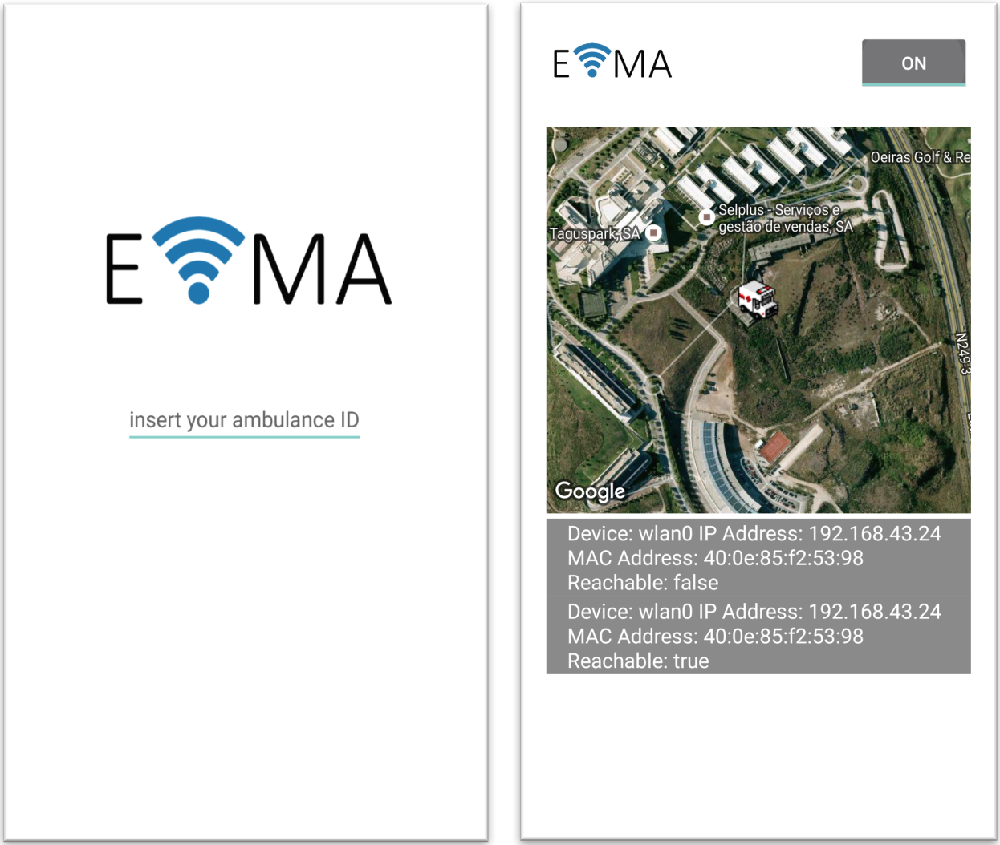
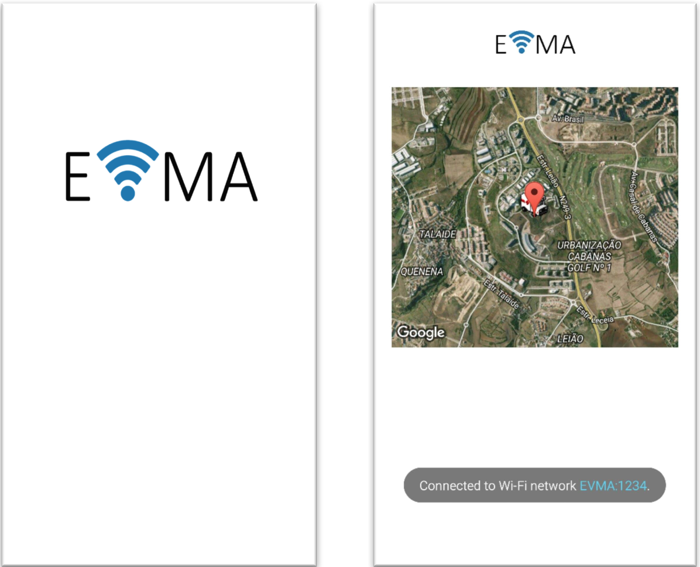

# Emergency Vehicle Movement Anticipation (EVMA)

EVMA is a detection system of emergency vehicles in real time without the need to use luminous/sound signals. This system was developed only in the ambulances context but it can be adapted to others (e.g. police vehicles).

With EVMA, the drivers can know a priori the presence of the emergency vehicles. Consequently, they will have time to act in accordance.
This system was designed to run in Android environments and it has two variants:

 - `EVMA for Ambulances`: The drivers can activate  the alarm mode, which it will create an access point with a specific SSID. After that, the app will broadcast alarm messages constantly within a certain range. These alarm messages contain: the exact location of the vehicle, vehicle ID and the alarm life time. 
 
  

 -`EVMA for client`: this variant is for all the "normal" vehicles. The app is constantly searching for the EVMA SSID's in range. When available, the app forces the connection to receive the alarm messages. This variant uses the Google Maps API to show the clients the location of the ambulance in real time.
 
  
